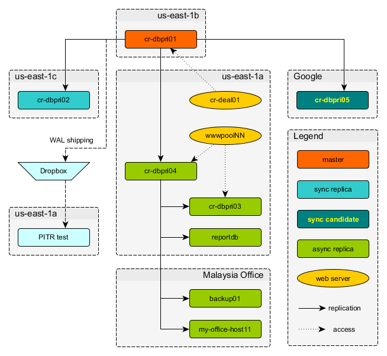

# bom-postgres
Postgres library

## CR Replication Schema



## Release Checklist

1. Do you expect a considerable amount of WAL?

  If so, forbid any other releases and make all **synchronous** replicas
  **asynchronous**.

1. When you thought about WAL, did you think about the hint bit?

  Reading through one of our huge tables usually generates lots of WAL.

1. Do you need to update constraints?

  If the table is small, you can apply the change simply by:

  ```sql
  ALTER TABLE ... ADD CONSTRAINT ...
  ```

  If it is large, take a 2-step approach. The first transaction creates the
  constraint but prevents `ALTER TABLE` from verifying it. The 2nd transaction
  then verifies it avoiding the `ACCESS EXCLUSIVE` lock acquired by `ALTER
  TABLE`.

  Example:

  ```sql
  BEGIN;            -- 1st transaction
  ALTER TABLE ONLY bet.financial_market_bet
    ADD CONSTRAINT pk_check_bet_class_value
        CHECK (
               (bet_class IN ('higher_lower_bet',
                              'range_bet',
                              'touch_bet',
                              'run_bet',
                              'legacy_bet',
                              'digit_bet',
                              'spread_bet')) IS TRUE
        ) NOT VALID;
  COMMIT;
  
  BEGIN;            -- 2nd transaction
  UPDATE pg_constraint
     SET convalidated=NOT EXISTS (
             SELECT *
               FROM bet.financial_market_bet
              WHERE NOT (
                 (bet_class IN ('higher_lower_bet',
                                'range_bet',
                                'touch_bet',
                                'run_bet',
                                'legacy_bet',
                                'digit_bet',
                                'spread_bet')) IS TRUE
          )
         )
   WHERE NOT convalidated
     AND conrelid='bet.financial_market_bet'::REGCLASS::OID
     AND conname='pk_check_bet_class_value';
  COMMIT;
  ```
  
  Note the `NOT VALID` at the end of the `ALTER TABLE` statement. Also, make
  sure the check condition matches exactly what you are testing in the
  `UPDATE` statement. Think about `NULL`s.

1. Are you adding or modifying `CHECK` constraints?

  Think about whether the `CHECK` condition can result in `NULL`. Check
  constraints only forbid changes if the result is `FALSE`. The following
  constraint does not forbid anything:

  ```sql
  ALTER TABLE tablename
    ADD CONSTRAINT constraintname
        CHECK (
            NULL
        );
  ```
  
  See the real-world example above on how to make sure the `CHECK` constraint
  fails for `NULL`s.

1. Monitor replication lag

  On the master:

  ```sql
  SELECT client_addr,
         application_name,
         state,
         flush_location,
         pg_size_pretty(pg_xlog_location_diff(pg_current_xlog_location(),
                                              flush_location)) as lag,
         sync_state
    FROM pg_stat_replication
   ORDER BY 2, 1;
  \watch
  ```

  Abort if you see `sync` in any of the `sync_state` fields.
