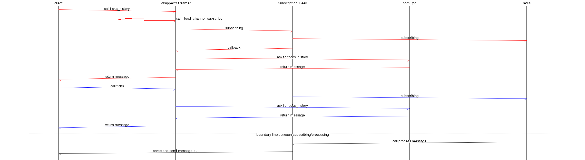

# The architecture of Subscription modules


There are following modules/classes in subscription sets.

## SubscriptionManager

This module maintains Redis subscriptions. Multiple clients may want to subscribe to the same channel, this manager coordinates them.
One redis server will have only one SubscriptionManager object, and vice versa.

SubscriptionManager will maintain a 'channels' hash (channel name => Future object) that stores a Future object to represent the status of that channel.
And it will also maintains a channel_subscriptions hash (channel name => address of subscriotion object => subscription object) that stores the subscriptions that subscribed that channel.

If there are many subscription objects to subscribe one same channel, there will be only one redis subscription. SubscriptionManager will look up the channel_subscription and dispatch the received messages.

Please refer to L<Binary::WebSocketAPI::v3::SubscriptionManager>

## General Flow of message

The general flow of messages is like this:


# Subscription role
This is base class/role of the subscription system. Please refer to L<Subscription> module.

## Some important methods/attributes

### subscribe/unsubscribe
do subscribing a stream to redis. It will call L<SubscriptionManager/subscribe> (unsubscribe) to subscribe a redis channel

### register/unregister
Register method will store the subscription object into stash. Unregister will remove it from stash so that it will be destroyed. The ref in stash should be the only one reference of subscription object.

### _unique_key
The _unique_key and class name will define a unique subscription object in that $c (websocket context).

### _channels_stash
The hash that store the subscription objects with the key _uinque_key. It is like this:

```
$c->{channels}{class_name}{unique_key} = $subscription;
```

### _uuid_channel_stash
The hash that store subscriptions with the key uuid. It is the index of subscriptions.

### already_registered
Will return the subscription if one subscription has already subscribed the channel with same _unique_key.

### handle_message
Process the message

## The message flow in Subscription System
The flow of message in Subscrition modules (Here 'subscription' is the subclass of "Binary::WebSocketAPI::v3::Subscription" like "Feed" "Transaction" "Pricer::Proposal" )


# Transaction subscription
This subscription class has 4 types: 

- buy: track the buy action of contract. When a contract is bought, a new poc subscription and a new transaction subscription with type sell will be created
- sell: track the sell action of contract. When a contract is sold, that poc subscription will be destroyed.
- transaction: track the transaction changes
- balance: track the balance changes.

## The flow of transaction stream.


# Feed subscription
The flow of feed stream:



# Prircer role
It is a role for Proposalxxxxx subscriptions. It has the following subclasses:

- Proposal
- ProposalOpenContract
- ProposalArray
- ProposalArrayItem

# Proposal subscription
## The flow of proposal stream:


# Proposal Open Contract subscription
## The flow of proposal open contract


# Proposal Array subscription
ProposalArray will not subscribe a real channel, it is only for storing information.
ProposalArray will receive an array of barriers, and it will split them to smaller chunks. Every chunk will 
be a ProposalArrayItem object. Every object will have several barriers.

## The flow of proposal array 


# Proposal Array Item subscription
PropsalArrayItem will run a job to collect all items and return to client
## The flow of Proposal Array Item subscription


# Relationship between subscriptions.

