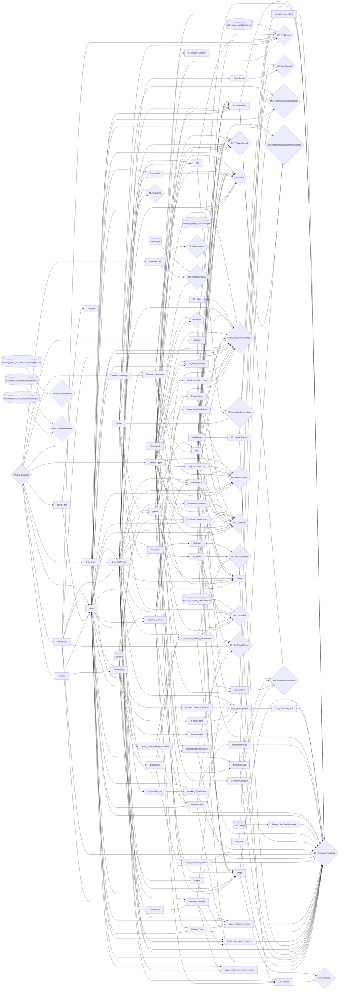

## Current Pricing Dataflow

This pricing dataflow should be greatly simplified by our [future planned API interface](index.md#future-plan).

```mermaid
flowchart LR
pr{"Pricing Request"}  --> pt["Price Type"]
pr --> ct["Contract Type"]
pr --> sym["symbol"]
sym --> ul["Underlying"]
pr --> cur["Contract Currency"]
pr --> st["Selected Tick"]
pr --> ds["Date Start"]
pr --> de["Date Expiry"]
pr --> sl["Strike List"]
pr --> mul["Multiplier"]
ct --> ipd["is_path_dependant"]
spot["Spot"] <--> pr
sym & pt & ds --> spot
spot --> ul
ul --> mkt["Market"]
ul --> sm["Submarket"]
ul --> exch["Exchange"]
exch & ds --> tc["Trading Calendar"]
ds & de & spot--> conp["Contract Period"]
conp --> iid["is_intraday_day"]
ct --> ifs["is_forward_starting"]
ul --> ifa["is_forex_alike"]
ul --> ast["Asset Symbol"]
ul --> qcs["Quoted Currency Symbol"]
ast & ifa & qcs & tc & conp --> iiqp["is_in_quiet_period"]
conp & spot --> es["Effective Start"]
ct --> cc["Contract Category"]
chron[("Chronicle")] --> tc
ct --> pot["Payout Type"]
ct --> potc["Payout Time Code"]
pt --> fs["for_sale"]
spot & ct & sl --> iac["is_ATM_contract"]
cur & conp --> rr["Discount rate/r rate"]
symbol & conp --> qr["q rate"]
rr & qr --> mu["mu"]
spot & chron --> vs["Volatility Surface"]
vs & sl & conp --> vol["Volatility / IV"]
vs --> scd["Surface Creation Date"]
vs --> ltp["Long Term Prediciton"]
symbol & conp --> ticks["Ticks"]
conp & spot --> rt["Reset Time"]
underlying --> ee["Economic Events"]
spot & chron & ct --> cuscom["Custom Commission"]
ct & iac & spot --> bt["Barrier Tier"]
symbol & conp --> mm["min_max"]
mm --> spot_min["Spot Min"]
mm --> spot_max["Spot Max"]
ul --> gi["Generation Interval"]
ul --> aftc["apply_forex_trading_condition"]
aftc & sm & ct & conp --> hemp["hour_end_markup_parameters"]
ul --> ss["Spot Spread"]
spot & sl & conp & qr & mu & vol & potc --> bsp["BS Probability"]
spot & sl & conp & qr & mu & vol & potc --> delta["Delta"]
spot & sl & conp & qr & mu & vol & potc --> vega["Vega"]
vs & conp & delta --> vol_spread["Vol Spread"]
spot & vs --> rod["Rollover Date"]
spot & vs --> roh["Rollover Hour"]
tc & conp & spot --> amrm["apply_mean_reversion_markup"]
tc & conp & spot --> aqpm["apply_quiet_period_markup"]
mkt & rod & roh & spot & conp --> arm["apply_rollover_markup"]
sm & ct --> aetm["apply_equal_tie_markup"]
qr & rr --> ird["Interest Rate Difference"]
aftc & iid & spot --> mie["market_is_inefficient"]
app_config[("App Config")] --> ehed["Enable Hour End Discount"]
mie --> ip["Inefficient Period"]
iiqp --> ltav["Long Term Avg Vol"]
spot & sl & rr & conp & mu & vol & ct & mul --> pe_cps{"PE::CallputSpread"}
st --> pe_hlr{"PE::HighLowRuns"}
ct & st & hly[("highlow.yml")] --> pe_hlt{"PE::HighLow::Ticks"}
sl & spot & conp & rt & rr & mu & vol & potc & pot & ct --> pe_reset{"PE::Reset"}
vs & scd & ct & vol & ds & de & spot & rr & mu & potc & qr & symbol & iac & for_sale --> pe_eds{"PE::EuorpeanDigitalSlope"}
itcy[("intraday_trend_calibration.yml")] --> pe_eds
symbol & ticks & ltp --> pe_ifb{"PE::Intraday::Forex::Base"}
ct & symbol & ds & ticks & ee & cuscom & bt --> pe_te{"PE::TickExpiry"}
ttcy[("tick_trade_coefficients.yml")] --> pe_te
sl & spot & conp & rr & mu & vol & potc & pot & ct --> pe_bs{"PE::BlackScholes"}
sl & spot & conp & rr & mu & vol & potc & pot & ct & spot_max & spot_min & gi & mul --> pe_lb{"PE::LookBack"}
ct & sl  --> pe_d{"PE::Digits"}
hemp & spot_max & spot_min --> mu_heb{"MU::HourEndBase"}
ihedmy[("intraday_hour_end_discount_multiplier.yml")] --> mu_hed{"MU::HourEndDiscount"}
symbol & conp --> mu_et{"MU::EqualTie"}
ss & delta --> mu_ss{"MU::SpotSpread"}
es & de & ee & symbol --> mu_eesr{"MU::EconomicEventsSpotRisk"}
vol_spread & vega --> mu_vs{"MU::VolSpread"}
amrm & min_max & cuscom & es & de & bt & symbol & conp & ee --> mu_ifr{"MU::IntradayForexRisk"}
aqpm & rod & arm & aetm & ird & ds & mkt & mie & cc & hemp & ehed & spot --> mu_ifr
ct & ip & vol & ltav & vega & ipd & delta & iac & bsp --> mu_ifr
bsp & min_max & spot & potc --> mu_imrm{"MU::IntradayMeanReversionMarkup"}
ct & spot & hemp & spot_min & spot_max & conp & symbol --> mu_lf{"MU:LondonFix"}
lfmmy[("london_fix_max_multiplier.yml")] --> mu_lf
cc & bt & es & de & bsp--> mu_cc{"MU::CustomCommission"}
ird & ds & potc & roh --> mu_rom{"MU::RollOverMarkup"}
ifhemy[("intraday_FS_hour_end_multiplier.yml")] --> mu_hem{"MU::HourEndMarkup"}
ihemy[("intraday_hour_end_multiplier.yml")] --> mu_hem
```

