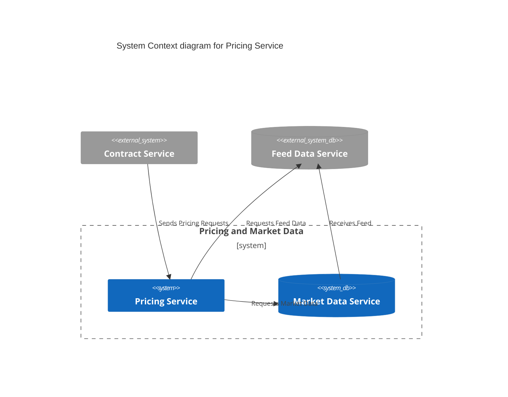
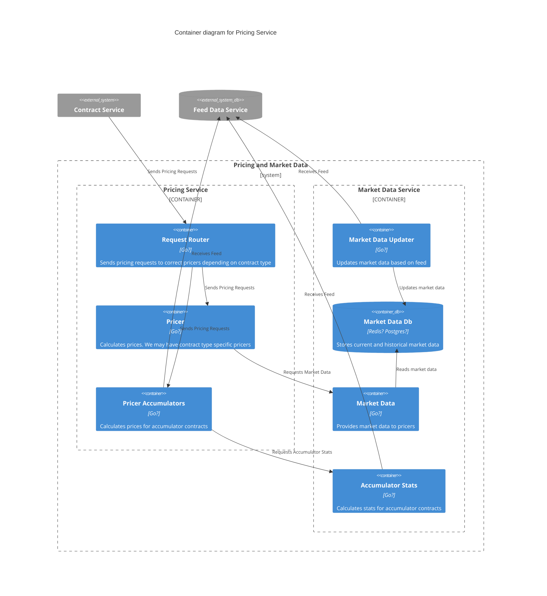

# API

## Current state

Description of the current pricing architecture can be [found in wikijs](https://wikijs.deriv.cloud/en/engineering/trading-engineering/pricer/pricer-overview).

We have prepared a local [dataflow chart](dataflow.md) representing the current state of the pricing code.

## Future plan

We are planning to expose functionality of pricing service via gRPC or HTTP API
in the future. Exact details of the API are to be finalised during Phase two of the Pricing API [roadmap](../roadmap). The main idea is to have the following service exposed as described using protobuf:

```protobuf
// Pricer calculates prices for contracts.
service Pricer {
    // AskPrice call calculates and returns the price of the specified proposal
    rpc AskPrice (AskPriceRequest) returns (AskPriceResponse) {}
    // AskPriceStream is a streaming call that streamps price updates for the specified proposal whenever there is a market update
    rpc AskPriceStream (AskPriceStreamRequest) returns (stream AskPriceStreamResponse) {}
    // BidPrice call calculates and returns the price of the specified open contract
    rpc BidPrice (BidPriceRequest) returns (BidPriceResponse) {}
    // BidPriceStream call streams price updates for the specified open contract whenever there is a market update
    rpc BidPriceStream (BidPriceStreamRequest) returns (stream BidPriceStreamResponse) {}
}
```

More details are available in [pricing.proto](proto/pricing.proto).

Below is the planned architecture of the Pricing service:




