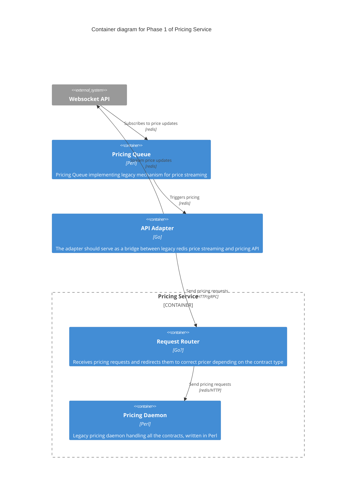
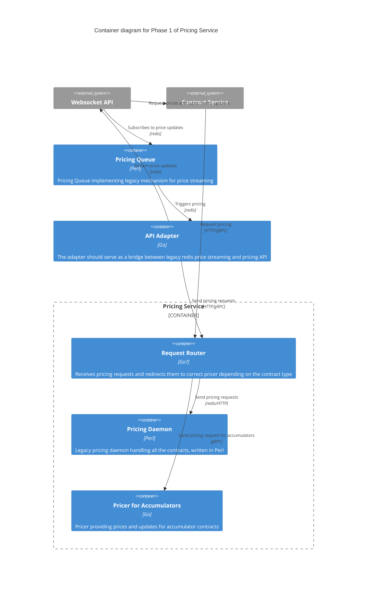

# Roadmap

## Pricing service roadmap

We have several tasks that we are planning to work on in the near future:

### Assist Feed Team with Feed Service

We depend on the existence of Feed Service providing the API that is needed
by pricing service, we are collaborating with Feed Business Service team on
that and are prepared to provide assistance they need to get this API ready
and running.

### Phase 1. Implement Pricing Service Request Router

We have [architectural design](../api/index.md) for pricing service, as the
first step on the way to moving to this design we want to implement router in
front of existing pricing daemon and make all pricing requests go via this
router. The Router should provide us the ability to expose pricing service as
an API. Here's C4 Container diagram for the phase 1:

### Collaborate with Contract Service team

Once we have the router and provide an API, we need to collaborate with
Contract Service team on getting Contract service ready as that is going to be
the main consumer of Pricing service API.

### Phase 2. Implement Pricer for Accumulator Contracts

Once we have router in place we can start implement pricers for specific types
of contracts. The first one that we are planning to implement is the pricer for
accumulators. It is something that significantly different from other types of
contracts and relatively easy to implement. Below is C4 Container diagram for
the phase 2, if the progress with Contract service is not sufficient we may
continue using Pricing Queue and API Adapter.

## Market Data roadmap

- Prepare a document with a list of all types of market data that we need to
  maintain and the sources of this data
- Design the API for Market Data services
- Implement the API for Market Data services that would provide access to
  market data that is currently stored in chronicle
