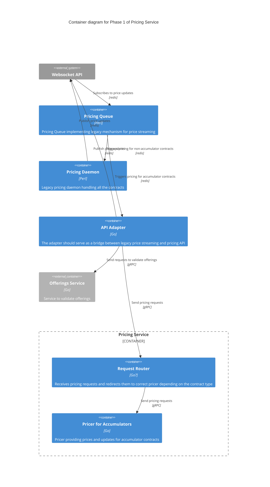
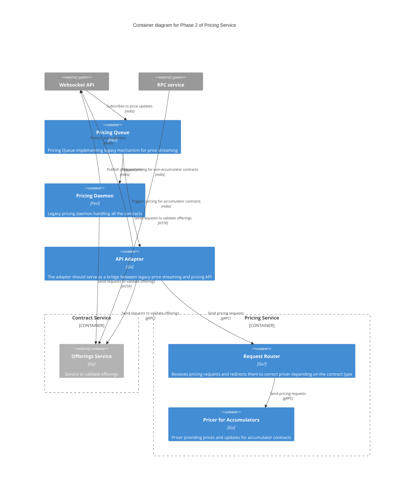
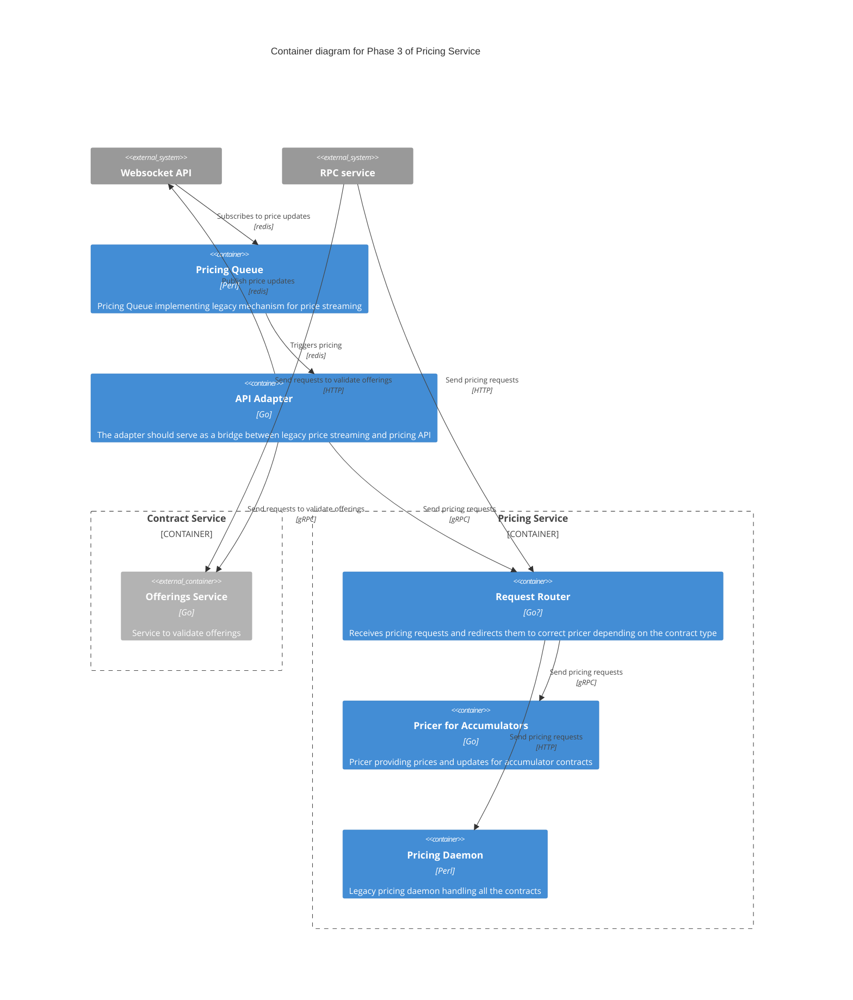

# Roadmap

You can find Gantt view of the roadmap in our [clickup space](https://app.clickup.com/20696747/v/g/kqknb-686695)

## Pricing Service Roadmap

Here is our roadmap for the mid-term future. The primary goal is to get to the
point where all pricing is done by our independent code that is exposed to the
rest of the Deriv backend over a well defined API.

### Phase 1. Implement Pricing Service Request Router

We have an [architectural design](../api/index.md) for the pricing service, as the
first step toward this design we want to implement the pricing service that
would only price accumulator contracts. The current price streaming services
are going to remain in place, but pricing queue will forward all the requests
to price accumulators to the new service. We need to implement the following
services:
- Offerings service -- this service is going to provide an API to query the
  list of available offerings and to validate offerings.
- Request router -- this is a part of the pricing business service. The Request
  router is going to forward pricing requests to the correct pricer based
  primarily on the contract type.
- Pricer for Accumulators -- this is a part of the pricing business service.
  This pricer is going to handle pricing requests for accumulators.
- API Adapter -- this is a temporary service that is going to fetch requests to
  price accumulators from the redis, send these requests to pricing service,
  and then publish responses back into redis.
Below is the C4 Container diagram for phase 1:

### Phase 2. Collaborate with Contract Service Team

We need to switch all existing code to use the new offerings service for
offerings validation. We should hand the offerings service over to the contract
service team and we need to collaborate with the contract service team to
support the development of the contract service, as this service will be the
primary consumre of the pricing service API.

### Phase 3. Move Legacy Pricer into the Pricing Service

Once we have the pricing service for accumulators and offerings service in
place we should be able to remove dependency on offerings code from the legacy
pricer daemon, and that in turn should enable us to move legacy pricer daemon
behind the pricing service router. Below is the C4 Container
diagram for phase 3.

## Challenges

The Pricing service needs certain external services in order to provide value.
In particular, it requires:

 - the Feed service to provide critical inputs, and
 - the Contract service to consume its output.

Hence, the development and success of the Pricing service are 
dependent on the development of these other services. We are
collaborating with the teams working on these services. We may 
correct our roadmap and plans in line with their progress.
